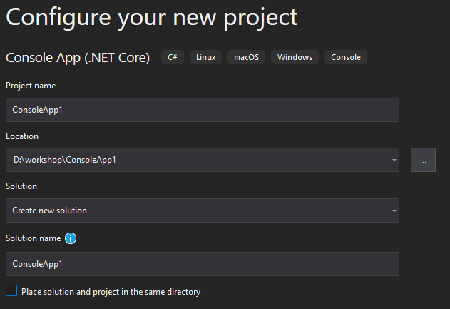
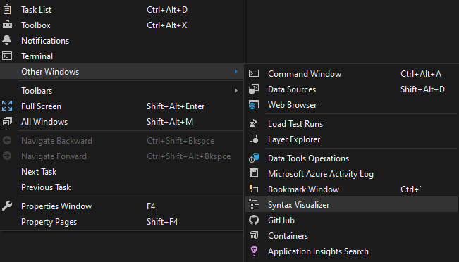
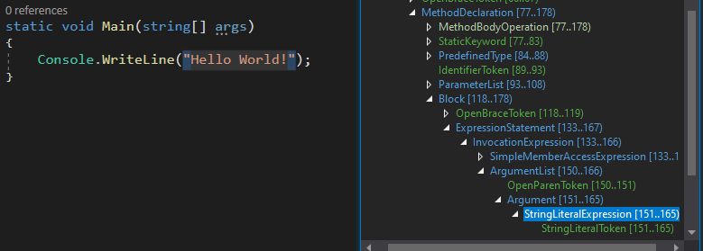
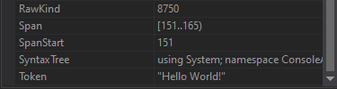
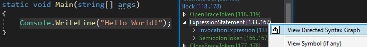
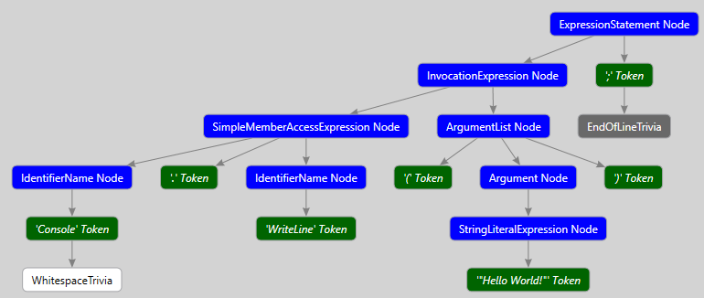

# Get familiar with Syntax Trees

In this chapter you will get familiar with **syntax trees** by inspecting them visually using the **Syntax Visualizer** and **DGML graphs**.

**Prerequisites**  
For this chapter we need **Visual Studio 2019** with the **.NET Compiler Platform SDK** and **DGML editor** installed.

## Open a blank *Visual Studio 2019*

## Create a new *Console App*

Make sure to choose the **.NET Core** version.

## Configure the new *Console App* project

The default values should be sufficient, make sure you store the project in an easy-to-reach place on disk.

*Do not put your code too deep in a folder structure, as we will use the absolute path in later excercises.*

## Open the *Syntax Visualizer Window*

You can find this window in the menu at `View > Other Windows > Syntax Visualize`.

## Navigate through your code and inspect the *Syntax Tree*

Discover the uses of, and differences between, **nodes**, **tokens**, and **trivia**.

Check the properties to see information about **spans**.

## View a *DGML graph* of your code selection

1. Select the line `Console.WriteLine("Hello World!");`.
2. Open the context menu on the activated `ExpressionStatement` in the syntax tree.
3. Select the `View Directed Syntax Graph` option.

   

This displays a DGML graph with all nodes, tokens, and trivia
*(or crashes your Visual Studio, in that case, retry these steps again)*.

