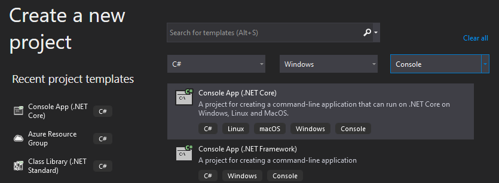
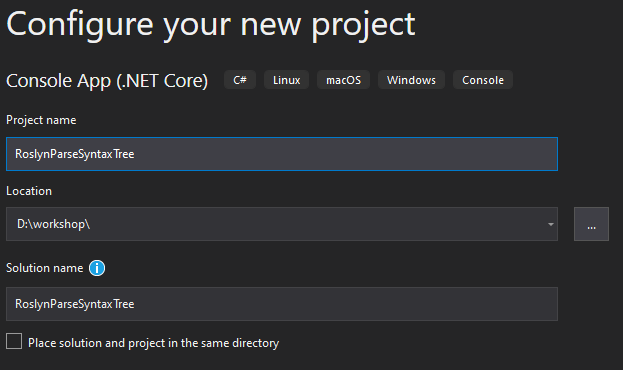
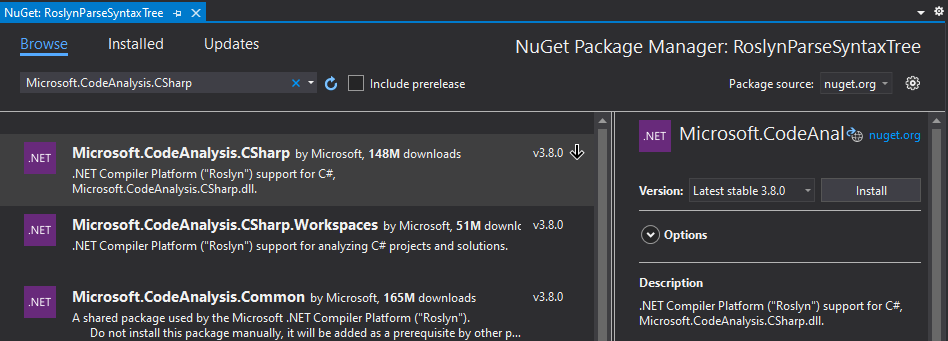

# Parse source code

In this chapter you are going to parse **source code** into a **syntax tree**.
Then you are going to query the tree the object model and LINQ queries.

**Prerequisites**  
For this chapter we need **Visual Studio 2019** with the **.NET Compiler Platform SDK** installed.

## Open *Visual Studio 2019*

## Create a new *Console App*

Make sure to choose the **.NET Core** version.



## Configure the new *Console App* project

Name the project `RoslynParseSyntaxTree`.

The default values should be sufficient, make sure you store the project in an easy-to-reach place on disk.



## Add a NuGet reference to *Microsoft.CodeAnalysis.CSharp*

Add a reference to the `Microsoft.CodeAnalysis.CSharp` NuGet package.

*Console*  

```sh
> dotnet add package "Microsoft.CodeAnalysis.CSharp"
```

*Package Manager*  


## Add namespaces

On top of the file, add the following namespaces.

```csharp
using System.Linq;
using Microsoft.CodeAnalysis;
using Microsoft.CodeAnalysis.CSharp;
using Microsoft.CodeAnalysis.CSharp.Syntax;
```

## Parse source code from text

*Add all code to the `Main` method.*

With `CSharpSyntaxTree.ParseText` you can parse text into a syntax tree.

Use the source code of the `Program.cs` file that was part of the `ConsoleApp1` project.  
For readability, use a verbatim string and do not forget to double the number of quotes for the `Hello World!` string.

```csharp
SyntaxTree tree = CSharpSyntaxTree.ParseText(@"using System;

namespace ConsoleApp1
{
    class Program
    {
        static void Main(string[] args)
        {
            Console.WriteLine(""Hello World!"");
        }
    }
}");
```

## Get the root of the Syntax Tree

To interact with the syntax tree, cast the root of the tree into a `CompilationUnitSyntax` class.

```csharp
var root = (CompilationUnitSyntax)tree.GetRoot();
```

## Interact with the root in the debugger

Set a breakpoint on the closing bracket of the `Main` method and run the application with the debugger (`[F5]`).


Inspect the `Usings` and the `Members` properties of the root using the debugger.


Notice you can keep navigating the node members until you arrive at the method declaration.

## Navigate the tree with code

Like the debugger, try to navigate the tree with code. You can use LINQ to get certain elements in a collection.

### Assignment

1. Navigate to the first `using`.
2. Navigate to the first `namespace`.
3. Navigate to the first `class` in the namespace.
4. Navigate to the first `method` in the class.
5. Navigate to the first `statement` in the method body.

#### Optional

*You can drill down further into the `statement` and look at the **Invocation Expression** and the **Member Access Expression**.*

### Solution

If you are not able to come up with the code yourself, you can use the following code:

```csharp
var @using = root.Usings.First();
var @namespace = root.Members.OfType<NamespaceDeclarationSyntax>().First();
var @class = @namespace.Members.OfType<ClassDeclarationSyntax>().First();
var method = @class.Members.OfType<MethodDeclarationSyntax>().First();
var expressionStatement = method.Body.Statements.OfType<ExpressionStatementSyntax>().First();
```

## Use spans to get the related source code from the tree

You can use the `SyntaxTree.GetText` method to get a reference all source text.
With the `SourceText.GetSubText` you can reference a `Span` and get the actual source text.

```csharp
var sourceText = tree.GetText();
```

### Assignment

Ouput the following source text to the `Console`.

1. The first `using` statement.
2. The first `statement` in the method body.

#### Optional

*If you did access the `Member Access Expression` before, you might output the **Expression** and **Name** parts.*

#### Awesomesauce

*Try to output the first `argument` from the **Invocation Expression***

### Solution

If you are not able to come up with the code yourself, you can use the following code:

```csharp
Console.WriteLine(sourceText.GetSubText(@using.Span));
Console.WriteLine(sourceText.GetSubText(expressionStatement.Span));
```

## Solution

You can compare your project with the [RoslynParseSyntaxTree solution](solutions/12.RoslynParseSyntaxTree/).
