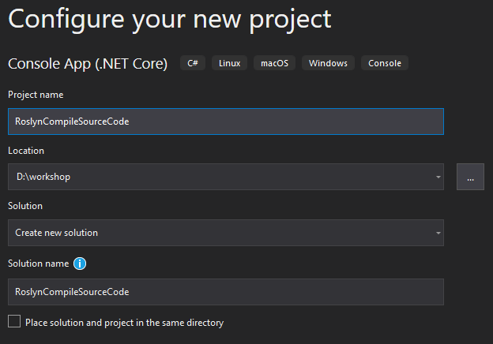
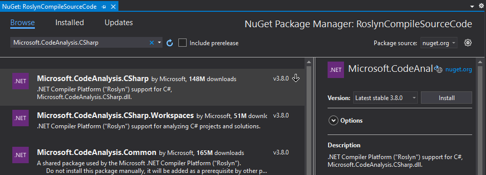

# Compile Source Code

In this chapter you are going to compile **source code** to get semantic information from the compiler.

**Prerequisites**  
For this chapter we need **Visual Studio 2019** with the **.NET Compiler Platform SDK** installed.

## Open *Visual Studio 2019*

## Create a new *Console App*

Make sure to choose the **.NET Core** version.


## Configure the new *Console App* project

Name the project `RoslynCompileSourceCode`.

The default values should be sufficient, make sure you store the project in an easy-to-reach place on disk.



## Add a NuGet reference to *Microsoft.CodeAnalysis.CSharp*

Add a reference to the `Microsoft.CodeAnalysis.CSharp` NuGet package.

*Console*  

```sh
> dotnet add package "Microsoft.CodeAnalysis.CSharp"
```

*Package Manager*  


## Add namespaces

On top of the file, add the following namespaces.

```csharp
using System.IO;
using System.Linq;
using Microsoft.CodeAnalysis;
using Microsoft.CodeAnalysis.CSharp;
using Microsoft.CodeAnalysis.CSharp.Syntax;
```

## Parse source code from text

*Add all code to the `Main` method.*

With `CSharpSyntaxTree.ParseText` you can parse text into a syntax tree.

Use the source code of the `Program.cs` file that was part of the `ConsoleApp1` project.  
For readability, use a verbatim string and do not forget to double the number of quotes for the `Hello World!` string.

```csharp
SyntaxTree tree = CSharpSyntaxTree.ParseText(@"using System;

namespace ConsoleApp1
{
    class Program
    {
        static void Main(string[] args)
        {
            Console.WriteLine(""Hello World!"");
        }
    }
}");
```

## Get the root of the Syntax Tree

To interact with the syntax tree, cast the root of the tree into a `CompilationUnitSyntax` class.

```csharp
var root = (CompilationUnitSyntax)tree.GetRoot();
```

## Compile the source code

To compile the source code you to create a `CSharpCompilation` object with a name for the assembly. This name does not really matter.
You also need to add at least one syntax tree, which is the source code we parsed in the previous steps.

```csharp
var compilation = CSharpCompilation
    .Create("Workshop")
    .AddSyntaxTrees(tree);
```

To get information about the compilation, we can get diagnostics. This is the same as the **Error List** we already know from Visual Studio.
You can output these messages to the console.

In this case you are only interested in non-hidden messages.

```csharp
var diagnostics = compilation.GetDiagnostics();

foreach (var error in diagnostics.Where(l => l.Severity > DiagnosticSeverity.Hidden))
{
    Console.WriteLine(error);
}
```

Run the application. The compilation should throw a list of errors.

```text
(1,7): error CS0246: The type or namespace name 'System' could not be found (are you missing a using directive or an assembly reference?)
(5,11): error CS0518: Predefined type 'System.Object' is not defined or imported
(7,26): error CS0518: Predefined type 'System.String' is not defined or imported
(7,16): error CS0518: Predefined type 'System.Void' is not defined or imported
(9,13): error CS0518: Predefined type 'System.Object' is not defined or imported
(9,13): error CS0103: The name 'Console' does not exist in the current context
(9,31): error CS0518: Predefined type 'System.String' is not defined or imported
(5,11): error CS1729: 'object' does not contain a constructor that takes 0   arguments
```

The compiler does not know where references should come from. So you have to add these to the compiler yourself.

We can use the location of the assembly which contains the definition of `object` as a reference.
Add a `MetadataReference` using this file location.
You also need to make sure that the runtime assembly is referenced. This is the `System.Runtime.dll` file in the same directory as the other file.

```csharp
var runtimeLocation = Path.Combine(Path.GetDirectoryName(typeof(object).Assembly.Location), "System.Runtime.dll");

var compilation = CSharpCompilation
    .Create("Workshop")
    .AddReferences(MetadataReference.CreateFromFile(runtimeLocation))
    .AddReferences(MetadataReference.CreateFromFile(typeof(object).Assembly.Location))
    .AddSyntaxTrees(tree);
```

Run the application again. Only a single error shows up.

```text
(9,13): error CS0103: The name 'Console' does not exist in the current context
```

### Assignment

Add the correct reference for `Console` and solve the error.

### Solution

If you are not able to come up with the code yourself, you can use the following code:

```csharp
    .AddReferences(MetadataReference.CreateFromFile(typeof(Console).Assembly.Location))
```

## Get the Semantic Model

Until now, the text `WriteLine` had some meaning to you from your experience, but it is just a plain text word in a text file.
Now that the compiler has analyzed the code it can tell you the semantic meaning of this word.

*Accessing the semantic model is a resource heavy operation and might be noticeable depending on the size of your application.*

Get the **Invocation Expression** connected to `WriteLine`, a quick way for now is a nice LINQ statement.

```csharp
var invocationExpression = root
    .Members.OfType<NamespaceDeclarationSyntax>().First()
    .Members.OfType<ClassDeclarationSyntax>().First()
    .Members.OfType<MethodDeclarationSyntax>().First()
    .Body.Statements.OfType<ExpressionStatementSyntax>().First()
    .Expression as InvocationExpressionSyntax;
```

You want to get the semantic model that is build during **compilation** and is connected to the source **tree**.

```csharp
var semanticModel = compilation.GetSemanticModel(tree);
```

Ask the semantic model which **Symbol** is related to the **Invocation Expression**.

```csharp
var methodSymbol = semanticModel.GetSymbolInfo(invocationExpression).Symbol;
```

`Console.WriteLine` has eighteen overloads.
If you look at the symbol information, it will only have the specific version of the method that the compiler has resolved for this invocation.

### Assignment

Output the following information from the Symbol:

1. The method `symbol`.
2. The containing `type`.
3. The containing `assembly` of this type.

#### Awesomesauce

*A symbol holds much more information that, for example, can be used for syntax highlighting. Output the list of the `Display Parts` of this symbol.
List the **kind** and **name** of each part.*

### Solution

If you are not able to come up with the code yourself, you can use the following code:

```csharp
Console.WriteLine(methodSymbol);
Console.WriteLine(methodSymbol.ContainingType);
Console.WriteLine(methodSymbol.ContainingType.ContainingAssembly);
```

## Solution

You can compare your project with the [RoslynCompileSourceCode solution](solutions/13.RoslynCompileSourceCode/).

The final output should read:

```text
System.Console.WriteLine(string)
System.Console
System.Console, Version=4.1.2.0, Culture=neutral, PublicKeyToken=b03f5f7f11d50a3a
```

The awesomesauce solution should give:

```text
NamespaceName = System
Punctuation   = .
ClassName     = Console
Punctuation   = .
MethodName    = WriteLine
Punctuation   = (
Keyword       = string
Punctuation   = )
```
