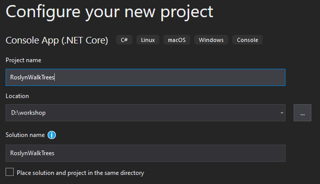
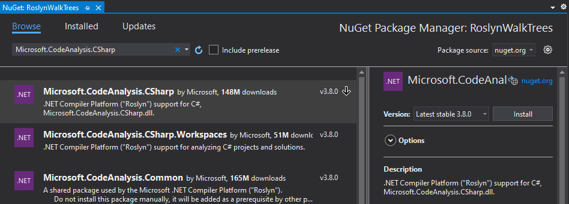

# Walk a Syntax Tree

In this chapter you are going to walk through a **syntax tree** using the visitor pattern.

**Prerequisites**  
For this chapter we need **Visual Studio 2019** with the **.NET Compiler Platform SDK** installed.

## Open *Visual Studio 2019*

## Create a new *Console App*

Make sure to choose the **.NET Core** version.


## Configure the new *Console App* project

Name the project `RoslynCompileSourceCode`.

The default values should be sufficient, make sure you store the project in an easy-to-reach place on disk.



## Add a NuGet reference to *Microsoft.CodeAnalysis.CSharp*

Add a reference to the `Microsoft.CodeAnalysis.CSharp` NuGet package.

*Console*  

```sh
❯ dotnet add package "Microsoft.CodeAnalysis.CSharp"
```

*Package Manager*  


## Add namespaces

On top of the file, add the following namespaces.

```csharp
using System.Linq;
using Microsoft.CodeAnalysis;
using Microsoft.CodeAnalysis.CSharp;
using Microsoft.CodeAnalysis.CSharp.Syntax;
```

## Parse source code from text

*Add all code to the `Main` method.*

With `CSharpSyntaxTree.ParseText` you can parse text into a syntax tree.

For this application there is a prepared piece of source code you are going to use.

```csharp
SyntaxTree tree = CSharpSyntaxTree.ParseText(@"
using System;
using System.Collections.Generic;
using System.Linq;
using System.Text;
using Microsoft.CodeAnalysis;
using Microsoft.CodeAnalysis.CSharp;
 
namespace TopLevel
{
    using Microsoft;
    using System.ComponentModel;
 
    namespace Child1
    {
        using Microsoft.Win32;
        using System.Runtime.InteropServices;
 
        class Foo { }
    }
 
    namespace Child2
    {
        using System.CodeDom;
        using Microsoft.CSharp;
 
        class Bar { }
    }
}");
```

You can see there are nested namespaces and `using` statements on all levels.
We can not use the root node `Usings` property or a single LINQ statement anymore to get all the using statements in the code.

The goal for this exercise is to get a list of all using statements that are not part of `System`.

## Get the root of the *Syntax Tree*

To interact with the syntax tree, cast the root of the tree into a `CompilationUnitSyntax` class.

```csharp
var root = (CompilationUnitSyntax)tree.GetRoot();
```

## Creating a *Syntax Walker*

There are two types of syntax visitors you can use to walk to through a syntax tree. The `CSharpSyntaxWalker` and the `CSharpSyntaxRewriter`.
Rewriters are useful if you want to change the tree, like analyzers are doing.

For documentation we only want to read the tree, so the **Syntax Walker** is more appropriate.

Create a new file called `UsingCollector.cs`.


## Add namespaces to file

On top of the file, add the following namespaces.

```csharp
using Microsoft.CodeAnalysis.CSharp;
using Microsoft.CodeAnalysis.CSharp.Syntax;
```

Make the class inherit from `CSharpSyntaxWalker`.

```csharp
class UsingCollector : CSharpSyntaxWalker
{
}
```

The base class has about 240 virtual methods you can override for your specific functionality.
In this example you are only interested in declarations of using statements. For this you override the `VisitUsingDirective` method.

```csharp
public override void VisitUsingDirective(UsingDirectiveSyntax node)
{
}
```

Whenever the visitor visits a Using Directive Syntax node anywhere in the tree, this method will be invoked.

### Assignment

1. Check if each namespace is not part of `System`.
2. Store the list of discovered **Using Directives** in a property called `Usings` on the `UsingCollector` class.

### Solution

If you are not able to come up with the code yourself, you can use the following code:

```csharp
class UsingCollector : CSharpSyntaxWalker
{
    public readonly List<UsingDirectiveSyntax> Usings = new List<UsingDirectiveSyntax>();
    
    public override void VisitUsingDirective(UsingDirectiveSyntax node)
    {
        if (node.Name.ToString() != "System" &&
            !node.Name.ToString().StartsWith("System.", StringComparison.Ordinal))
        {
            this.Usings.Add(node);
        }
    }
}
```

## Use the walker on the *Syntax Tree*

With the **Syntax Walker** in place, go back to the `Main` method and create an instance of the walker and execute the `Visit` method using the **root** as argument.

```csharp
var collector = new UsingCollector();
collector.Visit(root);
```

### Assignment

1. List all Usings that are not part of `System`.

### Solution

If you are not able to come up with the code yourself, you can use the following code:

```csharp
foreach (var directive in collector.Usings)
{
    Console.WriteLine(directive.Name);
}
```

## Solution

You can compare your project with the [RoslynWalkTrees solution](solutions/14.RoslynWalkTrees/).

The output should read:

```text
Microsoft.CodeAnalysis  
Microsoft.CodeAnalysis.CSharp  
Microsoft  
Microsoft.Win32  
Microsoft.CSharp
```
