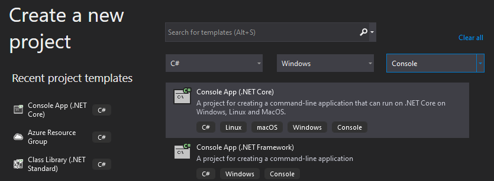
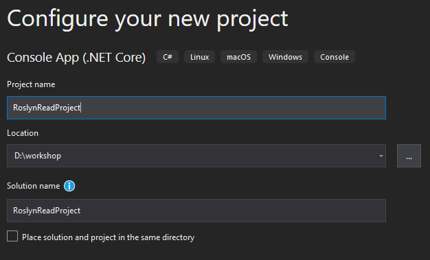
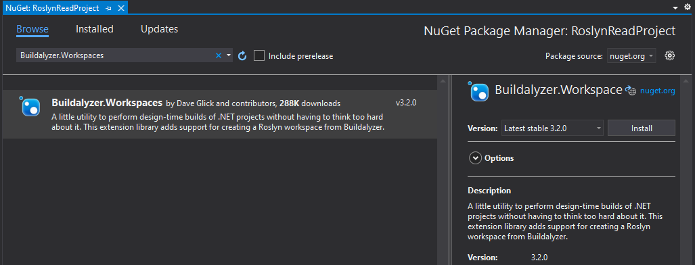

# Load a Project or Solution

Until now you had to do a lot of code and manual steps to parse a single tree, get the right references in the compiler and to get the semantic model.

This will not scale well if you want to work with a complete project or Visual Studio solution.

In this chapter you are going to parse a complete project using [Buildalyzer](https://github.com/daveaglick/Buildalyzer).

**Prerequisites**  
For this chapter we need **Visual Studio 2019** with the **.NET Compiler Platform SDK** installed.

## Open *Visual Studio 2019*

## Create a new *Console App*

Make sure to choose the **.NET Core** version.



## Configure the new *Console App* project

Name the project `RoslynReadProject`.

The default values should be sufficient, make sure you store the project in an easy-to-reach place on disk.



## Add a NuGet reference to *Buildalyzer.Workspaces*

Add a reference to the `Buildalyzer.Workspaces` NuGet package.

*Console*  

```sh
❯ dotnet add package "Buildalyzer.Workspaces"
```

*Package Manager*  


## Add namespaces

On top of the file, add the following namespaces.

```csharp
using System.IO;
using System.Linq;
using Buildalyzer;
using Buildalyzer.Workspaces;
using Microsoft.CodeAnalysis;
using Microsoft.CodeAnalysis.CSharp.Syntax;
```

## Read a project

To start using Buildalyzer you create an `AnalyzerManager`.
Use the `AnalyzerManager.GetProject` method to read the `ConsoleApp1` project you created in the first chapter.

```csharp
var analyzerManager = new AnalyzerManager();
var projectAnalyzer = analyzerManager.GetProject(@"D:\workshop\ConsoleApp1\ConsoleApp1\ConsoleApp1.csproj");
```

To parse the structure and references of the project, use the `AnalyzerManager.Build` method. The result is a collection, in this case you only need the first result.

```csharp
var analyzerResults = projectAnalyzer.Build().First();
```

### Assignment

Remember that in chapter 3, you added a single syntax tree and three references.

Output the following figures:

1. The number of `references`.
2. The number of `source files`.

   *Are you surprised by this output?*

3. Write the list of source files.

### Solution

If you are not able to come up with the code yourself, you can use the following code:

```csharp
Console.WriteLine($"{analyzerResults.References.Length} references");
Console.WriteLine($"{analyzerResults.SourceFiles.Length} source files");

Console.WriteLine();
foreach (var file in analyzerResults.SourceFiles)
{
    Console.WriteLine(file);
}
```

## Create a *workspace*

Although you read the project data into the manager, you can not work on the syntax trees yet.
First create a workspace. Compare a workspace with an IDE like Visual Studio.

```csharp
var workspace = projectAnalyzer.GetWorkspace();
```

The **workspace** has a reference to all loaded **solutions**, **projects**, **documents**, etc..  
Just like Visual Studio, loading a project will automatically create a solution.

Get a reference to the single project that is part of the solution end call the `Project.GetCompilationAsync` method.  
You will notice this method takes time as the same process that is executed when you compile a project in **Visual Studio** or with **MSBuild**.

Like the compilation we did manually before, you could look at the diagnostics if anything went wrong.

```csharp
var project = workspace.CurrentSolution.Projects.First();
var compilation = project.GetCompilationAsync().Result;

var diagnostics = compilation.GetDiagnostics();

foreach (var error in diagnostics.Where(l => l.Severity > DiagnosticSeverity.Hidden))
{
    Console.WriteLine(error);
}
```

## Working with the *Syntax Trees*

Before we had a single syntax tree we created manually.
Every file is a Syntax Tree, and with three files we can now iterate through the `Compilation.SyntaxTrees` property.

### Assignment

Use your skills from earlier assignments. For each syntax tree get the source text and output:

1. The **filename** of the source file.
2. The **source text** of that file.

If you worked with .NET Framework projects before, you would recognize one of the files that you might have thought did not exist anymore in .NET Core projects.

### Solution

```csharp
foreach (var syntaxTree in compilation.SyntaxTrees)
{
    var root = (CompilationUnitSyntax)syntaxTree.GetRoot();
    var text = root.GetText();

    Console.WriteLine();
    Console.WriteLine(Path.GetFileName(syntaxTree.FilePath));
    Console.WriteLine(text.GetSubText(root.Span));
}
```

## And the **semantic model**?

Remember that you create a semantic model with a syntax tree as an argument.
So, if you want to use the semantic model, you must create one for every tree inside the loop.

```csharp
var semanticModel = compilation.GetSemanticModel(syntaxTree);
```

## Solution

You can compare your project with the [RoslynReadProject solution](solutions/15.RoslynReadProject/).

The output should read:

```text
151 references
3 source files

D:\workshop\ConsoleApp1\ConsoleApp1\Program.cs
D:\workshop\ConsoleApp1\ConsoleApp1\obj\Debug\netcoreapp3.1\.NETCoreApp,Version=v3.1.AssemblyAttributes.cs
D:\workshop\ConsoleApp1\ConsoleApp1\obj\Debug\netcoreapp3.1\ConsoleApp1.AssemblyInfo.cs

Program.cs
using System;

namespace ConsoleApp1
{
    class Program
    {
        static void Main(string[] args)
        {
            Console.WriteLine("Hello World!");
        }
    }
}


.NETCoreApp,Version=v3.1.AssemblyAttributes.cs
using System;
using System.Reflection;
[assembly: global::System.Runtime.Versioning.TargetFrameworkAttribute(".NETCoreApp,Version=v3.1", FrameworkDisplayName = "")]


ConsoleApp1.AssemblyInfo.cs
using System;
using System.Reflection;

[assembly: System.Reflection.AssemblyCompanyAttribute("ConsoleApp1")]
[assembly: System.Reflection.AssemblyConfigurationAttribute("Debug")]
[assembly: System.Reflection.AssemblyFileVersionAttribute("1.0.0.0")]
[assembly: System.Reflection.AssemblyInformationalVersionAttribute("1.0.0")]
[assembly: System.Reflection.AssemblyProductAttribute("ConsoleApp1")]
[assembly: System.Reflection.AssemblyTitleAttribute("ConsoleApp1")]
[assembly: System.Reflection.AssemblyVersionAttribute("1.0.0.0")]

// Generated by the MSBuild WriteCodeFragment class.
```
