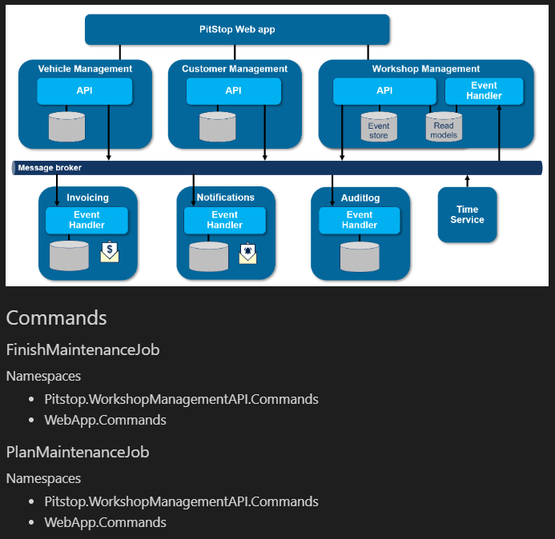

# Generate Documentation

In this chapter you will start building a documentation renderer.
You will build furter on the end solution of the previous chapter. You can make a copy if you want.

**Prerequisites**  
For this chapter you need the **.NET Core SDK** and **Visual Studio 2019** *or* **Visual Studio Code** installed.

## Clean up a bit

Comment out all code after the `Types.PopulateInheritedMembers` method. You can also remove the code, but some might be handy to have around for this chapter.

## Create a *Markdown Document*

As a start we will create a new Markdown document with static documentation. We can reuse images already created by the architect.

Crearing the document and its content is done using the `StringBuilder` object and the `File.WriteAllText` method.

Create a `StringBuilder` instance, add the title, and add the solution architecture image from the Pitstop project as a first chapter.

```csharp
var stringBuilder = new StringBuilder();

stringBuilder.AppendLine("# Pitstop Generated Documentation");
stringBuilder.AppendLine();
stringBuilder.AppendLine("## Service Architecture");
stringBuilder.AppendLine();
stringBuilder.AppendLine("");
stringBuilder.AppendLine();
```

Store the output in a Markdown file and open it in **Visual Studio Code**.

```csharp
File.WriteAllText("pitstop.generated.md", stringBuilder.ToString());
```


## Adding a list of *commands*

It is time to add dynamic content that is comming from the source code.
You are going to get all commands and list them as chapters.

First add the *Commands* chapter.

```csharp
stringBuilder.AppendLine("## Commands");
stringBuilder.AppendLine();
```

You are already familair with retrieving all command, so loop over the enumeration and write a chapter per command.

```csharp
foreach (var command in Types.Where(t => t.ImplementsType("Pitstop.Infrastructure.Messaging.Command")))
{
    stringBuilder.AppendLine($"### {command}");
    stringBuilder.AppendLine();
}
```

This will give something like this:

```text
## Commands

### RegisterVehicle

### RegisterCustomer

### FinishMaintenanceJob

### PlanMaintenanceJob

### FinishMaintenanceJob
```

The order might not be imprtant from a source code perspective, but for readers it can be more pleasant to order them alphabetically.

You can also notice some commands are listed multiple time. That is because both the sender and handler have their own implementation.

Now group and sort the commands. And add the namespaces that are containing the command.

```csharp
foreach (var group in Types.Where(t => t.ImplementsType("Pitstop.Infrastructure.Messaging.Command"))
    .GroupBy(t => t.Name)
    .OrderBy(g => g.Key))
{
    stringBuilder.AppendLine($"### {group.Key}");
    stringBuilder.AppendLine();

    stringBuilder.AppendLine("#### Namespaces");
    stringBuilder.AppendLine();
    foreach (var command in group.OrderBy(c => c.Namespace))
    {
        stringBuilder.AppendLine($"- {command.Namespace}");
    }
    stringBuilder.AppendLine();
}
```



Even though the documentation now reflects our source code, it is still very technical.
This can be improved by making some small but important textual changes.

* The command chapter names are in Pascal case, let's insert a space for every uppercase character. For this you can use the `ToSentenceCase` method.
* The namespaces do not reflect the service names used in the architecture image. But we can spot a pattern in the namespace named.
  If we take the second-to-last word, it reflects the service. Also here we can inject spaces for readability.
* Rename *Namespaces*, a source code concept, to *Service*.

```csharp
stringBuilder.AppendLine($"### {group.Key.ToSentenceCase()}");
stringBuilder.AppendLine();

stringBuilder.AppendLine("#### Services");
stringBuilder.AppendLine();
foreach (var command in group.OrderBy(c => c.Namespace))
{
    stringBuilder.AppendLine($"- {command.Namespace.Split('.').Reverse().Skip(1).First().ToSentenceCase()}");
}
```


Although the documentation is still based on the same technical concepts, it's is much more readable for a broader set of stakeholders.

### Assignment

1. Add a chapter for `Events`

### Solution

```csharp
stringBuilder.AppendLine("## Events");
stringBuilder.AppendLine();

foreach (var group in Types.Where(t => t.ImplementsType("Pitstop.Infrastructure.Messaging.Event"))
    .GroupBy(t => t.Name)
    .OrderBy(t => t.Key))
{
    stringBuilder.AppendLine($"### {group.Key.ToSentenceCase()}");
    stringBuilder.AppendLine();

    stringBuilder.AppendLine("#### Services");
    stringBuilder.AppendLine();
    foreach (var @event in group.OrderBy(e => e.Namespace))
    {
        stringBuilder.AppendLine($"- {@event.Namespace.Split('.').Reverse().Skip(1).First().ToSentenceCase()}");
    }

    stringBuilder.AppendLine();
}
```

## Adding message payload

A command or event communicates a set of relevant properties.
As you already have access to the type information, you can create a chapter with a table with all properties.

```csharp
if (group.SelectMany(t => t.Fields).Any())
{
    stringBuilder.AppendLine("#### Fields");
    stringBuilder.AppendLine();

    stringBuilder.AppendLine("|Property|Type|Description|");
    stringBuilder.AppendLine("|-|-|-|");

    foreach (var field in group.SelectMany(t => t.Fields)
        .GroupBy(f => (f.Type, f.Name))
        .Select(g => g.First())
        .OrderBy(f => f.Name))
    {
        stringBuilder.AppendLine($"|{field.Name}|{field.Type}|{field.DocumentationComments?.Summary}|");
    }

    stringBuilder.AppendLine();
}
```

Seeing the namespaces of data types can also be distracting. This can be stripped using the `ForDiagram` method.

```csharp
stringBuilder.AppendLine($"|{field.Name}|{field.Type.ForDiagram()}|{field.DocumentationComments?.Summary}|");
```

### Assignment

1. Add a the payload to the `Events`

### Solution

```csharp
stringBuilder.AppendLine("## Events");
stringBuilder.AppendLine();

foreach (var group in Types.Where(t => t.ImplementsType("Pitstop.Infrastructure.Messaging.Event"))
    .GroupBy(t => t.Name)
    .OrderBy(t => t.Key))
{
    stringBuilder.AppendLine($"### {group.Key.ToSentenceCase()}");
    stringBuilder.AppendLine();

    stringBuilder.AppendLine("#### Services");
    stringBuilder.AppendLine();
    foreach (var @event in group.OrderBy(e => e.Namespace))
    {
        stringBuilder.AppendLine($"- {@event.Namespace.Split('.').Reverse().Skip(1).First().ToSentenceCase()}");
    }

    stringBuilder.AppendLine();
}
```

## Solution

You can compare your project and the output with the [PitstopDocumentationRenderer solution](solutions/23.PitstopDocumentationRenderer/).
