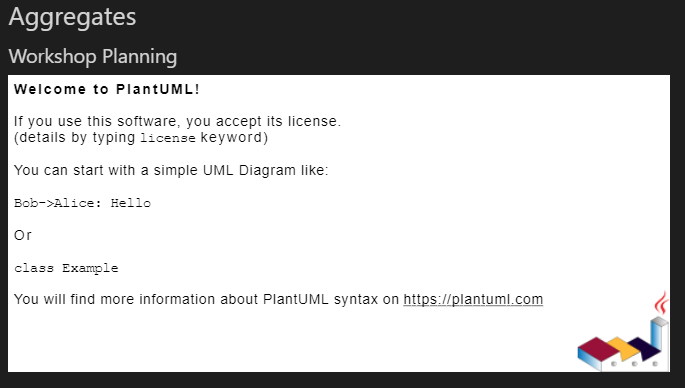
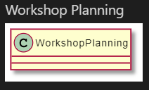
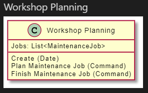
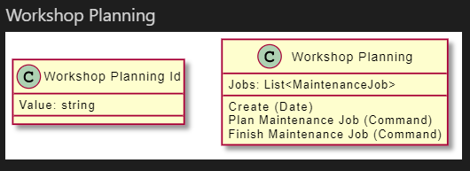
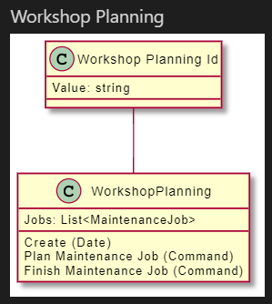
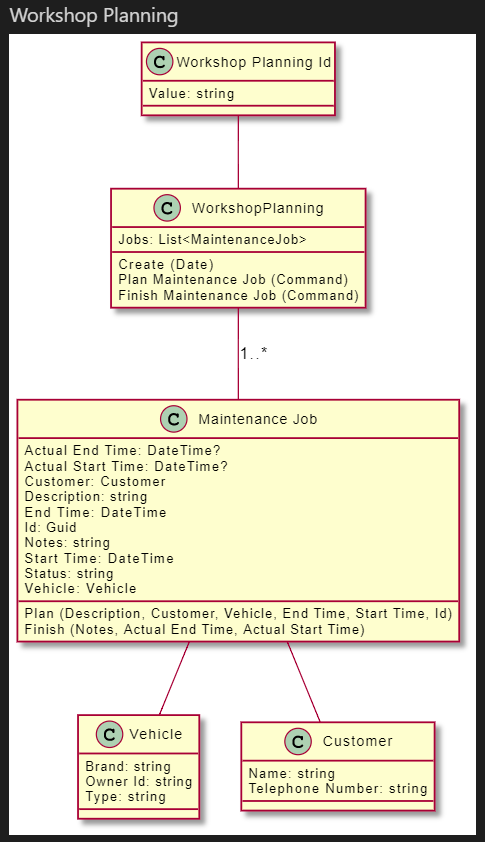

# Generate a class diagram

In this chapter you will start building class diagrams with PlantUML.

You will build furter on the end solution of the previous chapter. You can make a copy if you want.

**Prerequisites**  
For this chapter you need the **.NET Core SDK** and **Visual Studio 2019** *or* **Visual Studio Code** installed.

## Add namespace

On top of the `Program.cs` file, add the following namespace.

```csharp
using LivingDocumentation.Uml;
```

## Adding a diagram to *Markdown*

In Pitstop, aggregate roots are implementing the generic base class `Pitstop.WorkshopManagementAPI.Domain.Core.AggregateRoot<T>`.

Add a chapter for the aggregates and a subchapter for each aggregate root.

```csharp
stringBuilder.AppendLine("## Aggregates");
stringBuilder.AppendLine();

foreach (var aggregateRoot in Types.Where(t => t.ImplementsTypeStartsWith("Pitstop.WorkshopManagementAPI.Domain.Core.AggregateRoot<")))
{

    stringBuilder.AppendLine($"### {aggregateRoot.Name.ToSentenceCase()}");
    stringBuilder.AppendLine();
}
```

To add a PlantUML diagram, you can use a fenced code block with the `plantuml` specification.

If you are not familair with [PlantUML](https://plantuml.com/) yet, it is a language that allows you to quickly write all types of diagrams using plain text.

See the [Language specification](https://plantuml.com/sitemap-language-specification) for more details.

Add the PlantUML diagram itself by using the `@startuml` and `@enduml` words inside the code fence.

```csharp
stringBuilder.AppendLine("```plantuml");
stringBuilder.AppendLine("@startuml");

stringBuilder.AppendLine("@enduml");
stringBuilder.AppendLine("```");
stringBuilder.AppendLine();
```

This should give you the following output in Visual Studio Code:



## Render a *class*

PlantUML has support for [class diagrams](https://plantuml.com/class-diagram). Let's add the class to the diagram between the start and end tags.

```csharp
stringBuilder.AppendLine($"class {type.Name} {{");

stringBuilder.AppendLine("}");
```



We can specify the members. Enumerate the properties and add the to the class.
You can choose how you want to show them. Only the name of the property, the datatype, etc.

```csharp
foreach (var property in type.Properties)
{
    stringBuilder.AppendLine($"{property.Name}: {property.Type}");
}
```

Also you can hide private or in herited properties, and order them alphabetically.
It is up to you to think which information is relevant for you audience.

```csharp
stringBuilder.AppendLine($"class {type.Name} as \"{type.Name.ToSentenceCase()}\" {{");

foreach (var property in type.Properties.Where(p => !p.IsPrivate()).OrderBy(p => p.Name))
{
    stringBuilder.AppendLine($"{property.Name.ToSentenceCase()}: {property.Type.ForDiagram()}");
}
```

You can do the same for the methods. Also here you can think about adding the parameter names, their types, both.
Again, it is up to you to think about relancy for the audience.

```csharp
foreach (var method in type.Methods.Where(m => !m.IsPrivate() && !m.IsOverride()))
{
    var parameterList = method.Parameters.Select(p => p.Name.ToSentenceCase()).Aggregate("", (s, a) => a + ", " + s, s => s.Trim(',', ' '));
    stringBuilder.AppendLine($"{method.Name.ToSentenceCase()} ({parameterList})");
}
```



## Adding an entity with a *relationship*

The aggregate root has a **value object** as an ID. This is a relationship we might want to communicate.
As this is another class you need to render, move the class related string builder lines into a seperate method called `RenderClass`.
Pass the `StringBuilder` and `TypeDescription` as parameters.

```csharp
private static void RenderClass(StringBuilder stringBuilder, TypeDescription type)
{
    stringBuilder.AppendLine($"class {type.Name} as \"{type.Name.ToSentenceCase()}\" {{");

    foreach (var property in type.Properties.Where(p => !p.IsPrivate()).OrderBy(p => p.Name))
    {
        stringBuilder.AppendLine($"{property.Name.ToSentenceCase()}: {property.Type.ForDiagram()}");
    }

    foreach (var method in type.Methods.Where(m => !m.IsPrivate() && !m.IsOverride()))
    {
        var parameterList = method.Parameters.Select(p => p.Name.ToSentenceCase()).Aggregate("", (s, a) => a + ", " + s, s => s.Trim(',', ' '));
        stringBuilder.AppendLine($"{method.Name.ToSentenceCase()} ({parameterList})");
    }

    stringBuilder.AppendLine("}");
}
```

The aggregate id is a generic property of `AggregateRoot`. You can use the `GenericTypes` method the get all generic properties from a type string.

```csharp
var aggregateIDType = Types.First(aggregateRoot.BaseTypes.First(bt => bt.StartsWith("Pitstop.WorkshopManagementAPI.Domain.Core.AggregateRoot<")).GenericTypes().First());
```

Render the type before the root.

```csharp
RenderClass(stringBuilder, aggregateIDType);
```



You can define the relationship between to two classes. By making the line two hypens long, they will be positioned vertically in relation to each other.

```csharp
stringBuilder.AppendLine($"{aggregateIDType.Name} -- {aggregateRoot.Name}");
```



## Expanding on the *properties*

In the diagram you can see that `Jobs` is a list of `MaintenanceJob`. So let's make that also part of the diagram.

In the `RenderClass` method add an additional iteration over the propeties.
Everytime a property is known as a class defined in our source code (so no `System` types) render that type as a class.

```csharp
foreach (var propertyDescription in type.Properties)
{
    var property = Types.FirstOrDefault(t => string.Equals(t.FullName, propertyDescription.Type) || (propertyDescription.Type.IsEnumerable() && string.Equals(t.FullName, propertyDescription.Type.GenericTypes().First())));
    if (property != null)
    {
        RenderClass(stringBuilder, property);

        // Relation
        stringBuilder.Append($"{type.Name} -- {property.Name}");
        if (propertyDescription.Type.IsEnumerable()) stringBuilder.Append(" : 1..*");
        stringBuilder.AppendLine();
    }
}
```

Because of the recursive code, more entities pop up.



## A little help for writing PlantUML

You might already notice you are writing a lot of string builder methods, and you need to know the valid PlantUML keywords.

Facing with this same issue, I wanted to make my life a bit easier.
I started adding a lot of StringBuilder extension methods that might make life easier.
For example `UmlDiagramStart` and `UmlDiagramEnd` replace the begin and end tags for the diagram.

*This will continue into the new seperate [PlantUML.Builder](https://github.com/eNeRGy164/PlantUml.Builder) project.*

### Optional

*Replace the class rendering code with extension methods.*

```csharp
stringBuilder.ClassStart(type.Name, displayName: type.Name.ToSentenceCase());

foreach (var property in type.Properties.Where(p => !p.IsPrivate()).OrderBy(p => p.Name))
{
    stringBuilder.ClassMember($"{property.Name.ToSentenceCase()}: {property.Type.ForDiagram()}", property.IsStatic(), visibility: property.ToUmlVisibility());
}

foreach (var method in type.Methods.Where(m => !m.IsPrivate() && !m.IsOverride()))
{
    var parameterList = method.Parameters.Select(p => p.Name.ToSentenceCase()).Aggregate("", (s, a) => a + ", " + s, s => s.Trim(',', ' '));
    stringBuilder.ClassMember($"{method.Name} ({parameterList})", method.IsStatic(), visibility: method.ToUmlVisibility());
}

stringBuilder.ClassEnd();
```

### Awesomesauce

*Implement stereotypes and custom spots on the class to make a distinction between value **objects**, **entities** and the **root**.*

## Solution

You can compare your project with the [PitstopDocumentationRenderer solution](solutions/24.PitstopDocumentationRenderer/).
