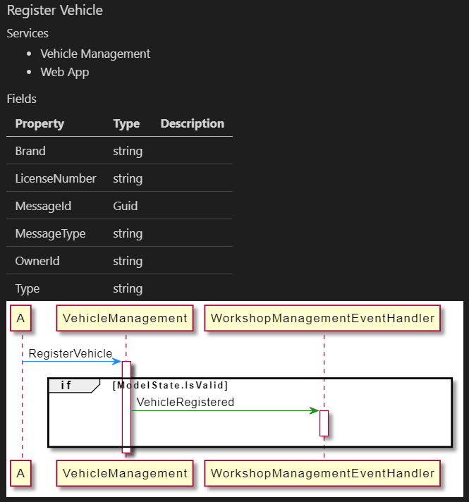
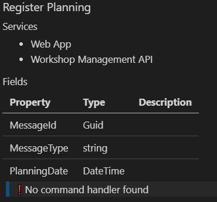
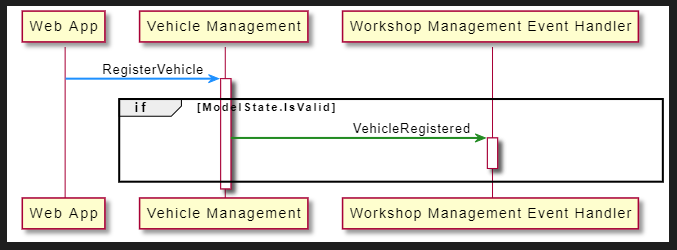

# Generate a Sequence Diagram

This chapter will go into generating sequence diagrams based on message flow between services.

The amount of code required to traverse trees, trace calls and generate the nesecery UML is too beg and complex to go through like we did in the other chapters.

You will build furter on the end solution of the previous chapter. You can make a copy if you want.

**Prerequisites**  
For this chapter you need the **.NET Core SDK** and **Visual Studio 2019** *or* **Visual Studio Code** installed.

## Add a lot of code

Create the following files from the source in git and add them to your project.

* [TypeDescriptionListExtensions.cs](https://github.com/eNeRGy164/LivingDocumentation.Workshop/blob/main/2.living-documentation/solutions/25.PitstopDocumentationRenderer/PitstopDocumentationRenderer/TypeDescriptionListExtensions.cs)
* [InteractionTraverser.cs](https://github.com/eNeRGy164/LivingDocumentation.Workshop/blob/main/2.living-documentation/solutions/25.PitstopDocumentationRenderer/PitstopDocumentationRenderer/InteractionTraverser.cs)
* [UmlFragmentRenderer.cs](https://github.com/eNeRGy164/LivingDocumentation.Workshop/blob/main/2.living-documentation/solutions/25.PitstopDocumentationRenderer/PitstopDocumentationRenderer/UmlFragmentRenderer.cs)

`TypeDescriptionListExtensions.cs`  
Extension methods to finds specific types or traverse through types and invocations.

`InteractionTraverser.cs`  
Extracts the *consequences* of the receiving a message.
Follows invocations through the code, keeping track of each service, foreach, if/else, and switch block the code passes through.

`UmlFragmentRenderer.cs`  
Converts found interactions into a PlantUML sequence diagram.
Basically, this is a second pass through the flow, but can't be combined with the previous step to be able to render nice activation lines.

## Add a *Command Diagram renderer*

Create a new static method called `RenderCommandDiagram`. Add a `StringBuilder` and `TypeDescription` as parameters.

Create a list to store the names of the services in a list. This makes it possible to render all participants nicely.

Create an instance of the `InteractionTraverser` and call the `ExtractConcequences` method with the type and services list.

Create a `StringBuilder` to get all UML content. Call the `UmlFragmentRenderer.RenderTree` static method to convert all interactions into an UML diagram.

Now you are almost done, you just need to add the diagram to the output document. This is the same as for the class diagrams.

```csharp
private static void RenderCommandDiagram(StringBuilder stringBuilder, TypeDescription type)
{
    var services = new List<string>();
    var interactions = new InteractionTraverser().ExtractConcequences(type, services);

    var innerBuilder = new StringBuilder();
    UmlFragmentRenderer.RenderTree(innerBuilder, interactions.Fragments, interactions);

    stringBuilder.AppendLine($"```plantuml");
    stringBuilder.UmlDiagramStart();
    
    stringBuilder.Append(innerBuilder);

    stringBuilder.UmlDiagramEnd();
    stringBuilder.AppendLine("```");
    stringBuilder.AppendLine();
}
```

## Calling the renderer

Go to the place where you are writting commands to the documentation file.
Just after the rendering of the table use the `Types.CommandHandlerFor` method to check if there is a command handlers found for that command.

If there is no handler found, we might add that fact to the documentation ad well, this might be a great discussion topic with your stakeholders.

Call the new `RenderCommandDiagram` function you just created when a handler is found.

```csharp
var type = group.First();
if (Types.CommandHandlerFor(type) != null)
{
    RenderCommandDiagram(stringBuilder, type);
}
else
{
    stringBuilder.AppendLine("> ❗ No command handler found");
    stringBuilder.AppendLine();
}
```

If you look at the output, the effects of a command on other services will become visible.



Also the message about a missing handler shows up nicely.



## Improving the readability of the diagram

The layout of the participant can be improved a bit.
Also that strange "A" participant is not very clear. This is a side effect of the traverser not finding the producer of the command.

This is probably a shortcomming of the current code, but it is easy to fix for now.

In the `RenderCommandDiagram` method, befor the rendering of the UML tree, replace the first service with the source of the command.

```csharp
// Fix missing caller
var callingServices = Types.GetSourceCommands(type);
if (callingServices.Count == 1)
{
    var service = InteractionTraverser.Service(callingServices[0]);

    services.Insert(0, service);
    interactions.Fragments.OfType<Arrow>().First().Source = service;
}
```

Normally PlantUML adds participants in the order they occur in the diagram. But if you want to modify the display name, you need to add the participants first yourself.

Add the list of participant before the `innerBuilder` is added.

```csharp
foreach (var service in services)
{
    stringBuilder.Participant(service, displayName: service.ToSentenceCase());
}
```

To make the rest of the diagram more pleasant, you can set skin parameters. Do this at the beginning of the diagram, just after the diagram start tag.

```csharp
stringBuilder.SkinParameter(SkinParameter.SequenceMessageAlignment, "reverseDirection");
stringBuilder.SkinParameter(SkinParameter.SequenceGroupBodyBackgroundColor, "Transparent");
stringBuilder.SkinParameter(SkinParameter.SequenceBoxBackgroundColor, "#Gainsboro");
stringBuilder.SkinParameter(SkinParameter.SequenceArrowThickness, "2");
stringBuilder.SkinParameter(SkinParameter.BoxPadding, "10");
stringBuilder.SkinParameter(SkinParameter.ParticipantPadding, "10");
stringBuilder.SkinParameter(SkinParameter.LifelineStrategy, "solid");
```



Note that in the if statement, the action code is shown. This leaks some technical information.

Personally I try to have a variable with a describing name to assign the value to, and use that variable in the if statement.
This is not only nice for the readers of the documentation, it also helps people understand what you are actually testing.

### Optional

*Add `hide footbox` to the diagram to remove the participants on the bottom of the diagram*

## Solution

You can compare your project and the output with the [PitstopDocumentationRenderer solution](solutions/25.PitstopDocumentationRenderer/).
