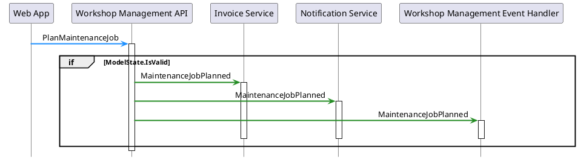
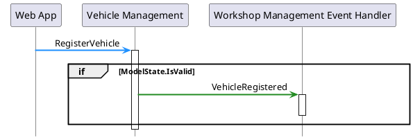
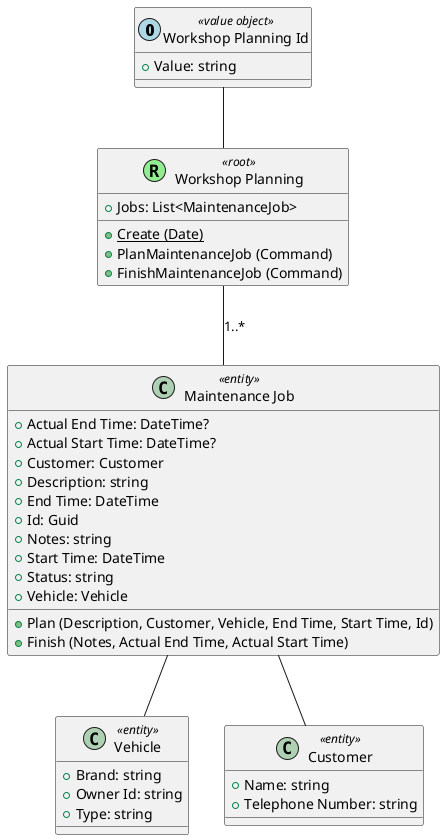

# Pitstop Generated Documentation

## Service Architecture

## Commands

### Finish Maintenance Job

#### Services

- Workshop Management API
- Web App

#### Fields

|Property|Type|Description|
|-|-|-|
|EndTime|DateTime||
|JobId|Guid||
|MessageId|Guid||
|MessageType|string||
|Notes|string||
|StartTime|DateTime||

### Plan Maintenance Job

#### Services

- Workshop Management API
- Web App

#### Fields

|Property|Type|Description|
|-|-|-|
|CustomerInfo|(string Id, string Name, string TelephoneNumber)||
|Description|string||
|EndTime|DateTime||
|JobId|Guid||
|MessageId|Guid||
|MessageType|string||
|StartTime|DateTime||
|VehicleInfo|(string LicenseNumber, string Brand, string Type)||

### Register Customer

#### Services

- Customer Management API
- Web App

#### Fields

|Property|Type|Description|
|-|-|-|
|Address|string||
|City|string||
|CustomerId|string||
|EmailAddress|string||
|MessageId|Guid||
|MessageType|string||
|Name|string||
|PostalCode|string||
|TelephoneNumber|string||

### Register Planning

#### Services

- Web App
- Workshop Management API

#### Fields

|Property|Type|Description|
|-|-|-|
|MessageId|Guid||
|MessageType|string||
|PlanningDate|DateTime||

> ❗ No command handler found

### Register Vehicle

#### Services

- Vehicle Management
- Web App

#### Fields

|Property|Type|Description|
|-|-|-|
|Brand|string||
|LicenseNumber|string||
|MessageId|Guid||
|MessageType|string||
|OwnerId|string||
|Type|string||

## Events

### Customer Registered

#### Services

- Customer Management API
- Invoice Service
- Notification Service
- Workshop Management Event Handler

#### Fields

|Property|Type|Description|
|-|-|-|
|Address|string||
|City|string||
|CustomerId|string||
|EmailAddress|string||
|MessageId|Guid||
|MessageType|string||
|Name|string||
|PostalCode|string||
|TelephoneNumber|string||

### Day Has Passed

#### Services

- Invoice Service
- Notification Service
- Time Service

#### Fields

|Property|Type|Description|
|-|-|-|
|MessageId|Guid||
|MessageType|string||

### Maintenance Job Finished

#### Services

- Invoice Service
- Notification Service
- Workshop Management API
- Workshop Management Event Handler

#### Fields

|Property|Type|Description|
|-|-|-|
|EndTime|DateTime||
|JobId|string||
|JobId|Guid||
|MessageId|Guid||
|MessageType|string||
|Notes|string||
|StartTime|DateTime||

### Maintenance Job Planned

#### Services

- Invoice Service
- Notification Service
- Workshop Management API
- Workshop Management Event Handler

#### Fields

|Property|Type|Description|
|-|-|-|
|CustomerInfo|(string Id, string Name, string TelephoneNumber)||
|Description|string||
|EndTime|DateTime||
|JobId|string||
|JobId|Guid||
|MessageId|Guid||
|MessageType|string||
|StartTime|DateTime||
|VehicleInfo|(string LicenseNumber, string Brand, string Type)||

### Vehicle Registered

#### Services

- Vehicle Management
- Workshop Management Event Handler

#### Fields

|Property|Type|Description|
|-|-|-|
|Brand|string||
|LicenseNumber|string||
|MessageId|Guid||
|MessageType|string||
|OwnerId|string||
|Type|string||

### Workshop Planning Created

#### Services

- Workshop Management API

#### Fields

|Property|Type|Description|
|-|-|-|
|Date|DateTime||
|MessageId|Guid||
|MessageType|string||

## Aggregates

### Workshop Planning

